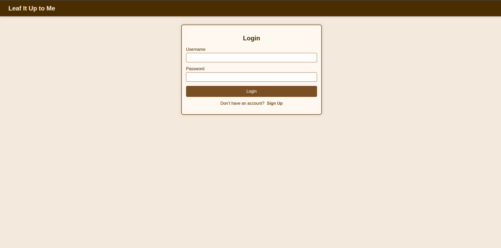
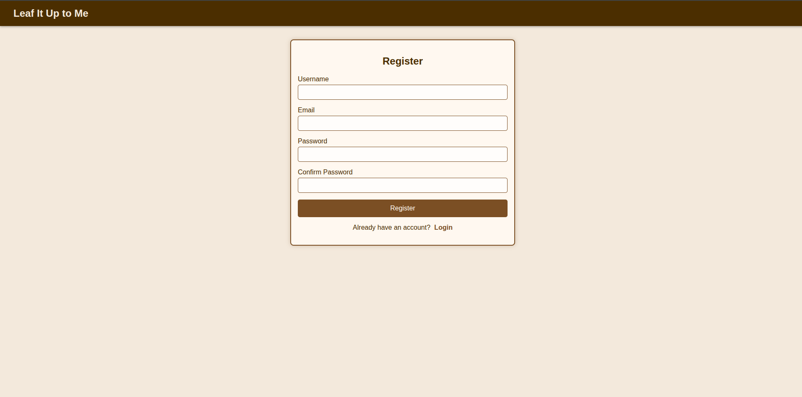
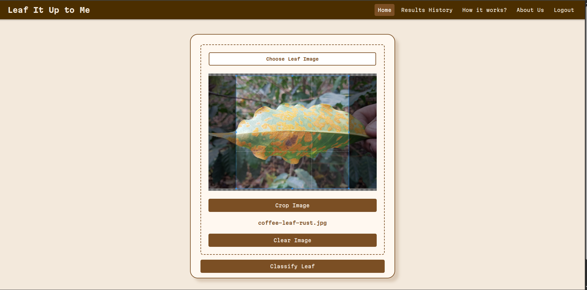
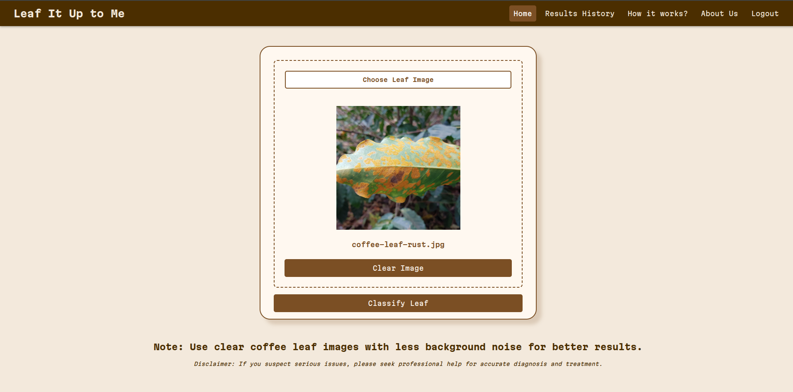
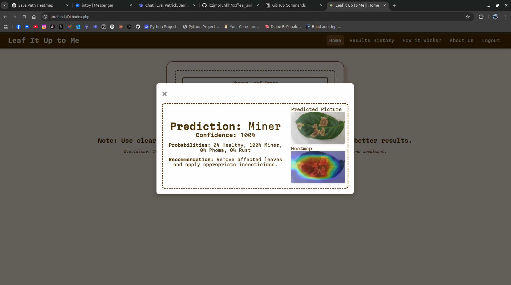
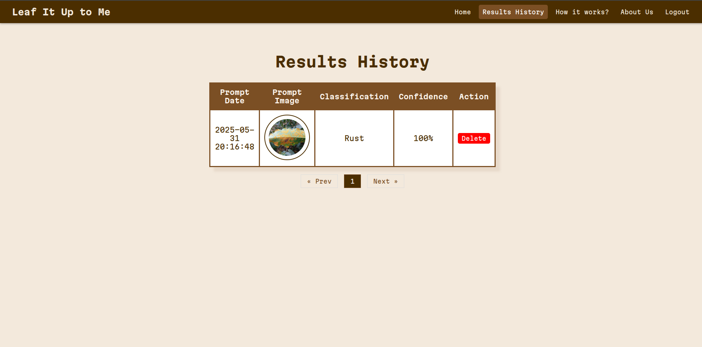

# Leaf It Up to Me

**Leaf It Up to Me** is a web application designed to detect coffee leaf diseases using a Convolutional Neural Network (CNN) based on MobileNetV2 architecture. The app classifies coffee leaf images into one of four categories:

- Healthy
- Rust
- Phoma
- Miner

This helps coffee farmers and agricultural professionals diagnose leaf diseases quickly and take appropriate action to protect crops.

---

## Technologies Used

- **Backend:** PHP 8.2
- **Machine Learning API:** Python 3.12 (FastAPI)
- **Machine Learning Model:** TensorFlow (MobileNetV2)
- **Frontend:** HTML/CSS/JavaScript

---

## Prerequisites

- XAMPP or LAMPP (for PHP and MySQL server)
- Python 3.12 installed
- Git (optional, for cloning repo)

---

## Setup Instructions

### 1. Create a Python virtual environment for FastAPI

```bash
python -m venv your_env_name
```

### 2. Activate the virtual environment

- **Windows:**

```bash
your_env_name\Scripts\activate
```

- **Linux/macOS:**

```bash
source your_env_name/bin/activate
```

### 3. Install Python dependencies

```bash
pip install tensorflow opencv-python fastapi pillow numpy uvicorn python-multipart
```

### 4. Run the FastAPI server

```bash
uvicorn main:app --reload
```

_(Replace `main` with your FastAPI app filename if different)_

---

## Usage

### Login / Register

Access the webapp and login/register with your credentials.





---

### Classify Coffee Leaf Image

Upload a clear image of a coffee leaf and click **Classify Leaf**.



You can choose not to or to crop your images before classifying.



---

### Results

View the prediction, confidence score, probabilities, and disease-specific recommendations.



---

### Results History

Review previous classifications stored in your user history.


